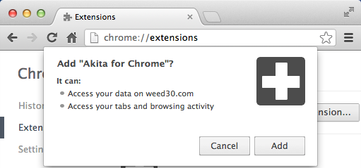
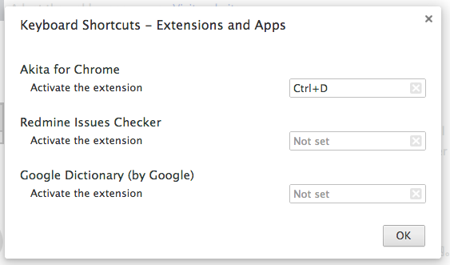

Install Extension
------------------

1. Download Chrome Extension ([akita-addon-chrome.crx](http://weed30.com/akita-addon-chrome.crx)) file
2. Open chrome://extensions
3. Drag *.crx file to browser and drop it when prompts to install 

Configure Shortcuts
------------------

1. Open chrome://extensions
2. Scroll to bottom and click link "Configure commands"
3. Find "Akita for Chrome" and set your own keys.

